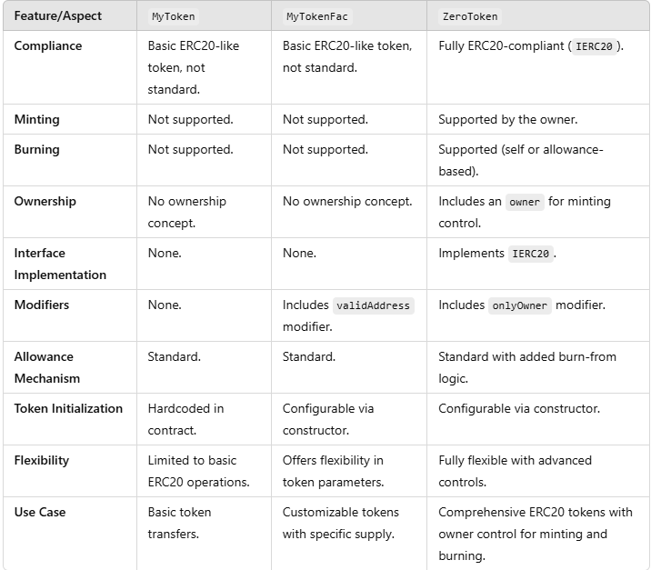

# DeFi Protocols - Smart Contract Development and Deployment

## Overview

This repository contains implementations of various DeFi protocols using the Ethereum blockchain. It includes smart contracts for **ERC20**, **ERC721**, and **ERC1155** tokens, along with examples for deploying and interacting with these contracts on Ethereum and other EVM-compatible networks. Additionally, the repository provides best practices for securing, testing, and deploying these smart contracts.

## Table of Contents

1. [Prerequisites](#prerequisites)
2. [Installation](#installation)
3. [Smart Contracts](#smart-contracts)
   - [ERC20](#erc20)
   - [ERC721](#erc721)
   - [ERC1155](#erc1155)
4. [Smart Contracts Auditig](#smart-contracts-auditing)
5. [Deployment](#deployment)
6. [Testing](#testing)
7. [Interacting with the Contracts](#interacting-with-the-contracts)

## Prerequisites

Before getting started, ensure you have the following installed:

- **Node.js** (version 18.6.0 or later)
- **npm** (for managing dependencies)
- **Solidity**
- **Hardhat** for smart contract development
- **Metamask** (for interacting with deployed contracts)
- **Infura** or **Alchemy** API keys for connecting to Ethereum nodes
- **slither** for smart contract auditing .

## Installation

1. Clone the repository:

   ```
   git clone https://github.com/YahyaBeguare/DEFI-Smart-Contracts
   ```

   Access the folder you cloned the project to

   ```
   cd "YOUR FOLDER NAME"
   ```

2. Install dependencies:

   ```
   npm install
   ```

3. Compile the smart contracts:

   ```
   npx hardhat compile

   ```

## Smart Contracts

### ERC20

The ERC-20 contract defines a standard for fungible tokens, widely used for utility tokens, governance tokens, and various other applications in the DeFi ecosystem

**Features:**

- Mintable
- Burnable
- Transferable

For detailed documentation, see [ERC20.md](https://ethereum.org/en/developers/docs/standards/tokens/erc-20/).

#### Basic Tokens Contracts

**MyToken.sol**

The MToken.sol contract implements fundamental token functionalities, including transferring tokens, approving allowances, and transferring on behalf of others using allowances. It sets an initial supply of 1 million tokens assigned to the deployer and includes events for transparency. The code is structured with clear validations and safeguards for common token operations.

**MyTokenFac.sol**

The MyTokenFac.sol is an ERC20-like factory contract that allows the creation of tokens with customizable properties (name, symbol, decimals, and total supply). The constructor assigns the initial supply to the deployer's balance. It includes essential ERC20 functionalities like token transfers, approval for spending, and transferring tokens on behalf of others.

You could customise the token properties in the tokenInfo.json file located in scripts\deployement\ERC20\basicToken\tokenInfo.json .

**TokensFactory.sol**

The TokensFactory contract is a smart contract that allows users to deploy multiple instances of customizable ERC-20 tokens through the MyTokenFac contract. It stores key details about each deployed token, such as its name, symbol, decimals, initial supply, and contract address. The contract emits an event when a new token is created and provides functions to retrieve token details by index or name.

#### Advanced Tokens Contracts

**ZeroToken.sol**

The ZeroToken contract is an ERC20-compliant implementation that supports minting and burning of tokens. It includes an ownership model, where only the owner can mint new tokens. The contract also adheres to the IERC20 interface, ensuring compatibility with ERC20 tools and standards. Key functionalities include standard ERC20 transfers, allowance-based token spending, and the ability to burn tokens from the caller or another account with an approved allowance.

**Comparison with Other Token Implementations**

Below is a feature comparison between `ZeroToken`, `MyToken`, and `MyTokenFac`:



### ERC721

The ERC-721 contract defines a standard for non-fungible tokens (NFTs), widely used for digital art, collectibles, gaming assets, and real-world asset tokenization.

**Features:**

- Mintable

- Burnable

- Enumerable

- Metadata

For detailed documentation, see [ERC721.md](https://ethereum.org/en/developers/docs/standards/tokens/erc-721/).

#### Advanced NFTs Contracts

**MyCollection.sol**
MyCollection is an ERC-721 NFT contract that allows the owner to mint and burn tokens ans sets the cost to mint tokens , while managing per-token metadata via URI storage. The contract is pausable, meaning token transfers and modifications (minting/burning) can be temporarily halted. It also stores a collection-level metadata URI to represent the overall collection. And it uses the openzeppelin implementation for a better security .
Noting that the owner of the contract could mint new tokens for free, but other users must pay the cost setted by the owner in the samrt contract to mint their tokens .

### ERC1155

The ERC1155 contract defines a multi-token standard, allowing a single contract to manage multiple token types (both fungible and non-fungible).

**Features:**

- Mintable

- Burnable

- Metadata

- Batch transfer capabilities

- Supports fungible and non-fungible tokens

#### Basic Contracts

**BasContract.sol**
The `BasContract` is an ERC-1155 token contract that allows the owner to mint and burn tokens. It utilizes OpenZeppelin's implementation for enhanced security. The contract includes functions to mint individual tokens (`mint`) and batch mint multiple tokens (`mintBatch`), both restricted to the contract owner. Additionally, it supports burning tokens (`burn` and `burnBatch`) and manages per-token metadata via URI storage. Notably, the contract does not implement pausing functionality, meaning token transfers and modifications cannot be temporarily halted.

#### Advanced contracts

**AdvContract.sol**
The `AdvContract` is an advanced ERC-1155 token contract that extends the functionalities of `BasContract`. It incorporates additional features such as pausing (`pause` and `unpause`) and supply tracking. The contract allows the owner to mint (`mint`) and batch mint (`mintBatch`) tokens, as well as burn tokens (`burn` and `burnBatch`). It also manages per-token metadata via URI storage and includes functions to set a new URI (`setURI`). The pausable functionality enables the owner to temporarily halt all token transfers and modifications, enhancing control over the contract's operations. Supply tracking ensures accurate accounting of token issuance and burning, providing a reliable total supply count for each token ID.

Both contracts leverage OpenZeppelin's implementations to ensure robust security and standard compliance. The primary distinction between them is the inclusion of pausing and supply tracking features in `AdvContract`, offering more advanced control mechanisms compared to `BasContract`.

## Audit contracts

Run the following commands to check the contracts audit report using the tool slither :

**MyTokenFac.sol**

```
slither contracts/ERC20/Basic/MyTokenFac.sol --solc-remaps "@openzeppelin/=./node_modules/@openzeppelin/"
```

**TokensFactory.sol**

```
slither contracts/ERC20/Basic/TokensFactory.sol --solc-remaps "@openzeppelin/=./node_modules/@openzeppelin/"
```

**MyCollection.sol**

```
slither contracts/ERC721/Advanced/MyCollection.sol --solc-remaps "@openzeppelin/=./node_modules/@openzeppelin/"
```

**ZeroToken.sol**

```
slither contracts/ERC20/Advanced/ZeroToken.sol --solc-remaps "@openzeppelin/=./node_modules/@openzeppelin/"
```

**AdvContract.sol**

```
slither contracts/ERC1155/AdvancedTokens/AdvContract.sol --solc-remaps "@openzeppelin/=./node_modules/@openzeppelin/"
```

**BasContract.sol**

```
slither contracts/ERC1155/BasicTokens/BasContract.sol --solc-remaps "@openzeppelin/=./node_modules/@openzeppelin/"
```

## Deployment

You could configure the defaultNetwork in the hardhat.config.js file, and set it to the network you want to use (By Default it's in the localhost netwok, and could choose between localhost, Ganache and sepolia) .

### Deployment Prerequisites

#### ERC20 Contracts

- Before deploying MyTokenFac.sol contract

  - Set the token details in the "scripts\deployement\ERC20\basicToken\tokenInfo.json" file

- Before deploying MyTokenFactory.sol cotract

  - Set the token details in the "scripts\deployement\ERC20\basicToken\factoryTokensInfo.json" file .

- Before deploying ZeroToken.sol contract
  - Set the token details in the "scripts\deployement\ERC20\advancedToken\advancedTokenInfo.json" file .

#### ERC721 Contracts

- Before deploying MyCollection.sol contract you should :
  - Make an account on pinata (https://docs.pinata.cloud/quickstart).
  - Set the PINATA_JWT and the GATEWAY_URL in the .env file .
  - Place a png image that you want to set for your NFT collection in the (ressources/ERC721/deployement) and name it "collection_image.png".
  - Set the collection details(name,symbol, description, inialOwner, attributes and mintingCost ) in the "ressources/ERC721/deployement/collectionData.json" file.

#### ERC1155 Contracts

- Before deploying BasContract.sol/AdvContract.sol contract you should :

  - Make an account on pinata (https://docs.pinata.cloud/quickstart).
  - Set the PINATA_JWT and the GATEWAY_URL in the .env file .

  - Ensure you have setted the tokens jpg images in the `"ressources\ERC1155\Basic\TokensPictures"`/ `"ressources\ERC1155\Advanced\TokensPictures"` folder and named them with their ids starting from 1.

- For the AdvContract, ensure you have setted the initialOwner of the contract in the `"ressources\ERC1155\Advanced\AdvContractArgs.json"` file . If not the deployer address will be setted automatically as the initial owner .
- Run the following command to upload the tokens images to IPS (first command for BasContract and the second is for AdvContract):

```sh
npm run uploadImages:BasContract
```

```sh
npm run uploadImages:AdvContract
```

Then the metadata json files will be generated in the `"ressources\ERC1155\Basic\TokensMetadata"`/ `"ressources\ERC1155\Advanced\TokensMetadata"` folder .

- Edit the generated tokens metadata files , here's an example of a fungible token's metadata:

```json
{
  "name": "Gold",
  "description": "The primary in-game currency used to purchase items and upgrades.",
  "image": "https://game.example/images/gold-icon.png",
  "attributes": [
    {
      "trait_type": "Fungibility",
      "value": "Fungible"
    }
  ]
}
```

and a NonFungible token's metadata :

```json
{
  "name": "Legendary Blue Skin",
  "description": "A rare and exclusive skin for elite players, featuring a vibrant blue color and unique design.",
  "image": "https://game.example/images/legendary-blue-skin.png",
  "attributes": [
    {
      "trait_type": "Type",
      "value": "Skin"
    },
    {
      "trait_type": "Rarity",
      "value": "Legendary"
    },
    {
      "trait_type": "Theme",
      "value": "Oceanic"
    }
  ]
}
```

- Then run following command to upload the tokens metadata to IPFS :

```sh
npm run uploadMetadata:BasContract
```

```sh
npm run uploadMetadata:AdvContract
```

Ps: the BaseURI will be outputted in the console .

### Deployement commands

Then depending on the defaultNetwork run the deployement command :

##### ERC20 Contracts

**MyToken.sol**

```sh
npm run deploy:MyToken
```

**MyTokenFac.sol**

```sh
npm run deploy:MyTokenFac
```

**ZeroToken.sol**

```sh
npm run deploy:ZeroToken
```

**TokensFactory.sol**

```sh
npm run deploy:TokensFactory
```

##### ERC721 contracts

**MyCollection.sol**

```sh
npm run deploy:MyCollection
```

Ps: Once the NFT collection contrat is deployed , a collectionInfo.json file that contains the collection details(name, symbol, URI, contract address, initial oner...) will be generated in the "scripts/deployement/ERC721" folder .

##### ERC1155 contracts

**BasContract.sol**

```sh
npm run deploy:BasContract
```

**AdvContract.sol**

```sh
npm run deploy:AdvContract
```

Else if you are navigating between different networks, you could run those commands for deployement without the need to reset the defaultNetwork each time you switch the network .

#### LocalHost network

To deploy the smart contracts on the local hardhat network

1. start the hardhat node in a separate terminal

```sh
npx hardhat node
```

2. run the deployement command :

##### ERC20 contracts

**MyToken.sol**

```sh
npm run deploy-localhost:MyToken
```

**MyTokenFac.sol**

```sh
npm run deploy-localhost:MyTokenFac
```

**ZeroToken.sol**

```sh
npm run deploy-localhost:ZeroToken
```

**TokensFactory.sol**

```sh
npm run deploy-localhost:TokensFactory
```

##### ERC721 Contracts

**MyCollection.sol**

```sh
npm run deploy-localhost:MyCollection
```

##### ERC1155 contracts

**BasContract.sol**

```sh
npm run deploy-localhost:BasContract
```

**AdvContract.sol**

```sh
npm run deploy-localhost:AdvContract
```

#### Ganache (Local Network)

To deploy the smart contracts on a local Ganache blockchain:

Start Ganache:

```sh
ganache-cli
```

Or just open the ganache app and log to the configured workspace .
Deploy the contracts:

##### ERC20 Contracts

**MyToken.sol**

```sh
npm run deploy-ganache:MyToken
```

**MyTokenFac.sol**

```sh
npm run deploy-ganache:MyTokenFac
```

**ZeroToken.sol**

```sh
npm run deploy-ganache:ZeroToken
```

**TokensFactory.sol**

```sh
npm run deploy-ganache:TokensFactory
```

##### ERC721 Contracts

**MyCollection.sol**

```sh
npm run deploy-ganache:MyCollection
```

##### ERC1155 contracts

**BasContract.sol**

```sh
npm run deploy-ganache:BasContract
```

**AdvContract.sol**

```sh
npm run deploy-ganache:AdvContract
```

#### Sepolia (Testnet)

To deploy on Sepolia testnet, make sure you have:

- Sepolia ETH (you can get it from a faucet).
- Your wallet's private key.
- An Infura or Alchemy API key for connecting to Sepolia.
  Update .env with your Sepolia credentials:

* SEPOLIA_PRIVATE_KEY= "your-private-key"
* INFURA_API_KEY= "your-infura-api-key"

Deploy to Sepolia:

##### ERC20 Contracts

**MyToken.sol**

```sh
npm run deploy-sepolia:MyToken
```

**MyTokenFac.sol**

```sh
npm run deploy-sepolia:MyTokenFac
```

**ZeroToken.sol**

```sh
npm run deploy-sepolia:ZeroToken
```

**TokensFactory.sol**

```sh
npm run deploy-sepolia:TokensFactory
```

##### ERC721 Contracts

**MyCollection.sol**

```sh
npm run deploy-sepolia:MyCollection
```

##### ERC1155 contracts

**BasContract.sol**

```sh
npm run deploy-sepolia:BasContract
```

**AdvContract.sol**

```sh
npm run deploy-sepolia:AdvContract
```

Ps: Once a contract is deployed, you could check its details on address.json file .

## Testing

You can run the complete test suite for the smart contracts using the following commands, and when you run the tests, a gas report will automatically be generated and displayed in the console. This report provides detailed insights into the gas consumption of each contract function, helping you optimize for efficiency and cost:

### ERC721

To test the MyCollection.sol contract , run this command :

```sh
npm run test:MyCollection
```

### ERC1155

- To test the BasContract.sol contract , run this command :

```sh
npm run test:BasContract
```

- To test the AdvContract.sol contract , run this command :

```sh
npm run test:AdvContract
```

## Interacting with the Contracts

After deployment, you can interact with the smart contracts using the hardhat console on your preffered network , this is an exapmle of using hardhat console on hardhat local network :

**Hardhat console**:

- Starts the console in a new terminal (assuming hardhat node is runing on another terminal for this example)

  ```sh
  npx hardhat console --network localhost

  ```

- **Ethers.js** for JavaScript-based interaction.

- **Metamask** for interacting with the contracts on the Ethereum network.

### ERC20 Contracts

**TokensFactory.sol**

To create new tokens from the factory

1. Customize your Tokens Details in the scripts\deployement\ERC20\basicToken\factoryTokensInfo.json file .
2. Execute the minting script by Running the command :

```sh
npm run mintToken
```

Or one of this commands for a specific network :

```sh
npm run mintToken-localhost
```

```sh
npm run mintToken-ganache
```

```sh
npm run mintToken-sepolia
```

3. The created tokens info will be stored to the factoryTokens.json file .

### ERC721 Contracts

**MyCollection.sol**

To mint new tokens on the MyCollection contrat

1. Place the image of the NFT in the "ressources/ERC721/mint/images" folder.
2. Customize your Tokens Details(name, descripton, receiver address, attributes) in the "ressources/ERC721/mint/mintingData.json" file, and make sure that the name of your token is the same as the the token image( Ex: "name" : "toto" , the image name should be toto as toto.jpg or toto.png or toto.jpeg....)
3. Execute the minting script by Running the command :

```sh
npm run mintNFT
```

Or one of this commands for a specific network :

```sh
npm run mintNFT-localhost
```

```sh
npm run mintNFT-ganache
```

```sh
npm run mintNFT-sepolia
```

Ps: By running the minting script, the program will try to find the image that has the same name of the token you want to mint, and upload it to IPFS, then creates in the "ressources/ERC721/mint/metadata" folder, the metadata json file for your token based on the details that you've specified in the mintingData.json file , and then includes the CID of the token image from IPFS, then upload the metadata file to IPFS and generates the URI to interact with the mint() function in the smart contract .

Check `"scripts\interactions\ERC721\interactInConsole.md"` file for more details to interact with the MyCollection contract and use other functionalities.

### ERC1155 Contracts

**BasContract.sol and AdvContract.sol**

To mint new tokens on the BasContract/AdvContracts contrat,execute the minting script by running the following command(first for BasContract and second for AdvContract) :

```sh
npm run mintToken:BasContract
```

```sh
npm run mintToken:AdvContract
```
